# Raffle — Stripe + DynamoDB + Rust on Lambda

Data layer for a UK charity society lottery: fixed-window raffles, £1 tickets, additional donations with
Gift Aid, and a VIP subscription charged ahead of each draw. The design and its compliance mapping are in
[`specs/01-dynamodb-data-model.md`](specs/01-dynamodb-data-model.md).

## Architecture



`diagrams/01-architecture-overview.mmd` is the source. Render it with
`mmdc -i diagrams/01-architecture-overview.mmd -o diagrams/01-architecture-overview.svg -b white`.

## Layout

The repository is a Rust workspace: one shared library crate holding the domain model and the storage
code, seven small Lambda binaries that call into it, and a workflow that ships them. The AWS resources
are declared once, in the shared `aws-cloud` repository, which this repo deploys into.

The shared crate is organised by feature rather than by layer. Everything about a raffle, an entrant, an
order, a subscription or a draw lives in one file: its types, its business rules, the shape of its rows in
the database, and the functions that read and write them. All five features share a single DynamoDB
table. The low-level mechanics of that table live in `table.rs` and nowhere else, so the storage rules
can be checked in one place while the meaning of the data stays with each feature.

```
crates/shared/src/table.rs         database core: the DynamoRepo handle, key scheme, read/write and paging primitives
crates/shared/src/raffle.rs        a raffle and its prize tiers; status is derived from its dates
crates/shared/src/entrant.rs       the supporter: personal details, marketing consent, Gift Aid, and erasure
crates/shared/src/order.rs         orders, the ticket ledger, and the gap-free ticket allocation transaction
crates/shared/src/subscription.rs  the saved-card VIP subscription and who is eligible for it
crates/shared/src/draw.rs          the draw record and its winners
crates/shared/src/stripe.rs        the PaymentGateway trait and the Stripe client (customers, intents, refunds)
crates/shared/src/error.rs         AppError and how each variant maps to an HTTP status
crates/shared/src/telemetry.rs     structured JSON logging and CloudWatch metrics
crates/shared/src/testing.rs       test fixtures: a local table and sample raffles, entrants and subscriptions
crates/shared/tests/               integration tests against DynamoDB Local
lambdas/api/                       public HTTP API: GET /raffles/current, POST /raffles/{id}/orders
lambdas/stripe-webhook/            Stripe webhook: signature check, ticket allocation, refunds, subscription creation
lambdas/subscription-charge/       hourly: charges every active subscriber once a raffle opens
lambdas/draw-run/                  admin-invoked: records the draw and picks winners using OS entropy
lambdas/admin/                     admin actions: raffles, prizes, cancellations, winner status, erasure
lambdas/reconcile/                 daily: Stripe charges against orders, ledger gaps, subscriber coverage
lambdas/canary/                    every 5 minutes: probes GET /raffles/current and fails when unhealthy
frontend/                          the checkout page and the local admin console: vanilla ES modules, no bundler
scripts/                           run it locally: table, seed, functions, frontend, Stripe webhook forwarding
```

Each Lambda is a thin handler: it parses its input, calls the shared crate, and returns. Payments go
through the `PaymentGateway` trait rather than the Stripe client directly, so every Lambda can be tested
end to end against DynamoDB Local with a scripted gateway standing in for Stripe.

## Configuration

`aws-cloud` sets every variable below on each function. You only need them by hand when running a Lambda
outside that stack, for instance against DynamoDB Local.

| Variable                | Read by                                                     | Purpose                                                        |
|-------------------------|-------------------------------------------------------------|----------------------------------------------------------------|
| `TABLE_NAME`            | every Lambda except `canary`                                | the DynamoDB table                                             |
| `METRIC_NAMESPACE`      | every Lambda                                                | CloudWatch namespace for custom metrics; defaults to `Raffle`  |
| `STRIPE_SECRET_KEY`     | `api`, `stripe-webhook`, `subscription-charge`, `reconcile` | Stripe API key                                                 |
| `STRIPE_WEBHOOK_SECRET` | `stripe-webhook`                                            | verifies the signature on incoming Stripe events               |
| `BROWSE_URL`            | `canary`                                                    | the `GET /raffles/current` URL to probe                        |

The AWS SDK reads its own settings from the environment: `AWS_REGION`, credentials, and
`AWS_ENDPOINT_URL_DYNAMODB` to point at a local endpoint instead of the real service.

Two steps in the Stripe dashboard complete the setup. Subscribe the `stripe-webhook` function URL from the
`aws-cloud` outputs to `charge.succeeded`, `charge.refunded` and `payment_intent.payment_failed`. Then add the Radar
rule `Block if :card_funding: = 'credit'`, which declines credit cards before a charge is made, as UK
gambling law requires.

## Operations

### Logs

Every Lambda writes one JSON object per log line with `level`, `message` and the identifiers in play, such
as `order_id`, `raffle_id` and `outcome`, so CloudWatch Logs Insights can filter on any field.

### Metrics

Counters go out as CloudWatch embedded metric format lines in the namespace `donation`. A metric filter
on the log group of every function with a URL adds `Http5xx` from any line whose `status` is 500 or more.
That is eight custom metrics in total, inside the ten the free tier allows.

| Metric                                                                  | Source                | Meaning                                                     |
|-------------------------------------------------------------------------|-----------------------|-------------------------------------------------------------|
| `WebhookAllocated`, `WebhookFailed`                                     | `stripe-webhook`      | orders given tickets, and orders failed, per Stripe event   |
| `SubscriptionsCharged`, `SubscriptionsDeclined`, `SubscriptionsErrored` | `subscription-charge` | outcome of each subscriber charge in the hourly run         |
| `SubscriptionChargeLagHours`                                            | `subscription-charge` | hours a raffle has been open without a completed charge run |
| `IntegrityViolations`                                                   | `reconcile`           | invariants the daily check found broken                     |
| `Http5xx`                                                               | log metric filter     | 5xx responses from any function with a URL                  |

### Alarms

`apps/donation.tf` in `aws-cloud` declares eight alarms and the shared table adds two, all notifying the
platform's SNS topic and through it the platform's `alert_email`. They fire when:

- `api`, `stripe-webhook` or `subscription-charge` crashes or times out
- a function with a URL answers 5xx five or more times in five minutes
- the browse canary fails twice in a row, or stops running: at least ten minutes unhealthy
- `api` invocations are throttled
- the table throttles reads or writes, meaning its 25 provisioned units need raising by hand
- a raffle has been open for more than three hours without a completed subscription charge run
- the daily reconciliation finds a violation, or does not run

### Scheduled jobs

| Lambda                | Schedule         | What it does                                                            |
|-----------------------|------------------|-------------------------------------------------------------------------|
| `canary`              | every 5 minutes  | fetches `GET /raffles/current`; healthy means a 200 carrying `current`  |
| `subscription-charge` | every hour       | charges every active subscriber once a raffle opens                     |
| `reconcile`           | daily, 06:00 UTC | checks the ledger, Stripe charges and subscriber coverage, listed below |

The canary fails its own invocation on an unhealthy response, so its alarm is a plain Lambda Errors
alarm that also fires if the canary stops being scheduled: no invocation means no datapoint, and missing
data counts as breaching. Two consecutive five-minute periods must breach, so a browse outage pages after
at least ten minutes, and a canary that stops being invoked takes longer still. It probes
`/api/raffles/current` on the site itself, the path the public takes.

The reconcile run makes four checks: each live raffle's ticket ledger for gaps, recent ledger entries
against their orders, the last 48 hours of Stripe charges against order state, and that every due
subscriber holds a PaymentIntent once a raffle has been open for a day. Its report is the invocation
result, and every violation is also an `ERROR` log line.

### Cost

The stack is sized for the AWS always-free tier: Lambda function URLs rather than API Gateway, provisioned
table capacity at the free 25 read and 25 write units (15 on the table, 5 on each of the two indexes), the
AWS-owned encryption key, no point-in-time recovery, ten alarms and eight custom metrics. Capacity is
fixed: there is no autoscaling, because each target-tracking policy creates its own CloudWatch alarms and
those bill beyond the free ten.

Only a table over 25 GB bills. A launch spike throttles instead of scaling; the SDK's retries absorb short
bursts, the throttle alarms page for the rest, and raising `local.free_capacity` for the launch window
costs a few pounds in unit-hours above the free 25.

## Scalability

The stack is sized for a charity's launch morning rather than a ticket agency's: an email goes out, a
few thousand supporters open the page within the hour, and a few hundred buy in the busiest minute.
Each part has a known ceiling and a named way past it. The spec lists the design ceilings under
"Deliberate simplifications and their ceilings"; this section puts measured numbers on them. Two ignored
tests produce the measurements and rerun with the same Docker recipe as the suite:

```bash
cargo test -p stripe-webhook --test stress -- --ignored --nocapture
cargo test -p shared --test shard -- --ignored --nocapture lost_rounds
```

Both run against DynamoDB Local, which commits a transaction in a few milliseconds where the real
service takes twenty to forty, so the rates below are upper bounds and the shapes are the allocator's
own. Pointing the same tests at a real region needs credentials, and they leave their on-demand tables
behind.

### What a sale costs

Browsing costs the table almost nothing. CloudFront caches `GET /api/raffles/current` for thirty
seconds, so however many people open the page, the origin answers a few reads a minute.

A checkout is one `api` invocation: two reads, then the entrant, the consent, the Gift Aid declaration
and the order written one after another, with a Stripe call in between to create the PaymentIntent and a
second one to create a Customer for a new subscriber.

A paid order is one `stripe-webhook` invocation: a consistent read of the order and of the raffle, then
one transaction that moves the ticket counter, writes the ledger row and marks the order paid. DynamoDB
charges transactional writes double, so the allocation alone is six write units on the table. Both
indexes project every attribute, so an index is written whenever an indexed row changes at all:

| Pool  | Writes per sale | Which writes                                                                    |
|-------|-----------------|---------------------------------------------------------------------------------|
| table | 10              | entrant, consent, Gift Aid and order, then the three-item transaction at double |
| GSI1  | 5               | entrant, order, entry, the order's `PAID` flip and the raffle's counter update  |
| GSI2  | 2               | the order's creation and its `PAID` flip                                        |

A lost allocation round, a compare-and-set that failed because another sale landed first, is billed as
well: the cancelled transaction consumes write capacity and its two consistent reads are spent. Under a
burst the losers dominate the bill. In the measurement below, 160 simultaneous paid orders spent about
five write units on lost rounds for every one on a successful allocation.

### Where the ceilings are

| Limit            | Where it bites                                  | Ceiling                                   |
|------------------|-------------------------------------------------|-------------------------------------------|
| GSI1 writes      | 5 units, 5 per sale                             | about 1 sale a second sustained           |
| table writes     | 15 units, 10 per sale                           | about 1.5 sales a second sustained        |
| GSI2 writes      | 5 units, 2 per sale                             | about 2.5 sales a second sustained        |
| Lambda           | the account's concurrency quota                 | 10 on a new account until raised          |
| Stripe API       | 100 write requests a second in live mode        | 100 checkouts a second                    |
| ticket counter   | one compare-and-set per raffle                  | any paced rate; about 80 arriving at once |
| raffle partition | 1,000 write units a second on one partition key | about 160 allocations a second            |

**Capacity is the first wall, and it is the index's.** Five write units on GSI1 against five writes per
sale is one sale a second. DynamoDB banks up to five minutes of unused capacity, so a burst of about
three hundred sales goes through from idle before the index throttles, and a throttled index throttles
the base table's writes with it. The SDK's retries absorb a short overrun and the throttle alarm pages
for a long one. That is the right size between raffles and for steady selling. For a launch window raise
`local.free_capacity` in `modules/table` of `aws-cloud` in a change of its own, and lower it again
afterwards.

**The Lambda quota needs checking before any launch.** A new account can start with a quota of ten
concurrent executions shared by every function, and below a hundred the platform reserves nothing, so
the reserved concurrency of one on the scheduled functions is not in effect either. Under such a quota,
webhooks retrying through a throttle hold the same slots the checkout needs. Check Service Quotas the
week before, not the morning of.

**The counter is measured.** The stress test delivers `charge.succeeded` events straight to the webhook
handler, skipping Stripe and the signature check, for one raffle:

| Delivery                   | Allocated  | Answered 500 | Latency p50 |
|----------------------------|------------|--------------|-------------|
| 40 at once                 | 40 of 40   | 0            | 0.37 s      |
| 80 at once                 | 80 of 80   | 0            | 0.71 s      |
| 160 at once                | 100 of 160 | 60           | 1.7 s       |
| 320 at once                | 91 of 320  | 229          | 3.3 s       |
| 10 a second for 5 seconds  | 50 of 50   | 0            | 15 ms       |
| 50 a second for 5 seconds  | 250 of 250 | 0            | 7 ms        |
| 100 a second for 5 seconds | 500 of 500 | 0            | 5 ms        |

The counter copes with any rate it can drain and fails on simultaneity. The ten jittered attempts cover
roughly eighty webhooks arriving in the same instant; beyond that the losers exhaust their attempts, the
webhook answers 500 and Stripe redelivers the event minutes later, while the confirmation page gives up
after sixty seconds and asks the supporter to reload. Numbers arrive late, never lost. Real payments are
spread by human checkout time, so a few hundred buyers a minute reach the webhook a few a second, well
inside the budget, and the subscription charge run charges one subscriber at a time, so its webhooks
arrive spaced.

### Reaching 200 paid orders a second

Four changes, none of them to the rows.

1. **Take the counter out of the race.** Let `stripe-webhook` verify the signature, put the event on an
   SQS FIFO queue with the raffle id as the message group, and answer 200. A new `allocate` function
   consumes the queue, and FIFO's one batch in flight per group makes it the single writer for each
   raffle. It reads the counter once per batch of ten, then writes the raffle update, ten ledger rows
   and ten order updates in one transaction: twenty-one items against the hundred a transaction allows.
   The counter condition stays as a guard that never fails, the retry loop goes, and a batch takes the
   twenty milliseconds a single order takes today, so one consumer allocates several hundred sales a
   second per raffle. The page keeps polling `GET /api/orders/{id}` exactly as now. This is the queue
   the spec names; it and the extra function cost pence at launch volume and nothing between raffles.
   Record three things with it: a poison message blocks its group, so a dead-letter queue with a low
   receive count is mandatory; the sold-out refund moves into the consumer; and 200 to Stripe then
   means accepted, not allocated.
2. **Give the table room.** Two hundred sales a second is around two thousand write units on the table
   and a thousand on each index. Rather than guess, switch the table to on-demand for the launch: it
   serves four thousand writes a second from the first minute and bills per request, so a quiet week
   costs pence. Switch back to provisioned afterwards; DynamoDB allows one change of mode a day.
3. **Ask Stripe for headroom.** Live mode allows a hundred write requests a second and every checkout
   is at least one, so two hundred sales a second is over the limit before a single subscriber signs
   up. Stripe raises the limit for a planned launch on request. Ask a couple of weeks ahead.
4. **Raise the account's Lambda concurrency.** A checkout spends most of its time waiting on Stripe,
   around a third of a second, so two hundred a second is sixty to eighty concurrent `api` executions
   plus a handful for the webhook and the consumer. The default quota of a thousand covers it
   comfortably, but a new account starts far lower; request the raise before the launch rather than on
   the morning.

Past two hundred the ledger itself is the next ceiling. Every ticket row of a raffle sits in the
raffle's partition, and a partition writes a thousand units a second. DynamoDB splits a hot partition
on its own, but not instantly, so a raffle expected to pass that rate wants its capacity raised the day
before rather than the hour before.

### A sharded counter, measured

If a queue is refused, the counter can be split instead. `shared::shard` keeps eight `COUNTER#` rows
per raffle, each owning an eighth of the licence cap; an order hashes to a home shard and moves to the
next one when its own is full; the ledger key becomes `ENTRY#{shard}#{offset}`; and the draw still picks
one uniform integer in 1 to N, where N is the sum of the eight counts frozen in the draw record, mapped
to a shard and an offset by prefix sums. It is not wired into any function. Its contention test races
paid orders on one raffle and counts the compare-and-set rounds lost, median of five runs, with the
orders that exhausted their ten attempts:

| Orders at once | One counter         | Eight shards |
|----------------|---------------------|--------------|
| 40             | 124, none exhausted | 50, none     |
| 80             | 439, up to 3        | 151, none    |
| 160            | 1,349, about half   | 562, none    |

DynamoDB Local serialises every transaction through one lock, so the shards cannot commit in parallel
there and the ratio understates the real service. What the shards buy is the exhaustion column. What
they cost: eight contiguous runs instead of one, a shard-prefixed ticket label, a tail of at most eight
times one less than the per-order maximum that can stay unsold at the cap, and, before a real run, a
partition key per shard so the shards spread across partitions rather than sharing the raffle's. The
queue keeps one gapless run and costs less to write, so it stays the first choice when launch money is
being spent; the shards are the measured fallback.

The other ceilings, the subscription charge run at a few thousand subscribers a raffle and the
reconciliation's 48-hour window, are listed with their upgrade paths in the spec.

## Admin operations

`admin` and `draw-run` answer `POST /api/admin` and `POST /api/draw` on the site, and only to a browser
carrying a Cognito access token this app's user pool signed; everything below is the body of that POST.
They can still be invoked with IAM credentials through the AWS CLI for break-glass, but the payload is
then an HTTP event rather than the bare action, so the CLI examples here use `curl`. The `admin` payload
names an `action` and its fields. Field names are camelCase, money is in pence and dates
are ISO 8601 in UTC. A raffle's life in four calls: create it, add a prize, run the draw, then mark the
first winner paid.

```bash
aws lambda invoke --function-name raffle-prod-admin --cli-binary-format raw-in-base64-out \
  --payload '{"action":"createRaffle","raffleId":"winter-2026","name":"Winter Poppy Raffle 2026","ticketPricePence":100,"maxTicketsPerOrder":20,"maxTickets":5000000,"opensAt":"2026-09-30T00:00:00Z","closesAt":"2027-01-08T23:59:59Z","drawAt":"2027-01-22T12:00:00Z","resultsAt":"2027-02-05T12:00:00Z"}' out.json
aws lambda invoke --function-name raffle-prod-admin --cli-binary-format raw-in-base64-out \
  --payload '{"action":"putPrize","raffleId":"winter-2026","rank":1,"name":"First prize","amountPence":2000000,"quantity":1}' out.json
aws lambda invoke --function-name raffle-prod-draw-run --cli-binary-format raw-in-base64-out \
  --payload '{"raffleId":"winter-2026","conductedBy":"Responsible Person","witnessedBy":"Auditor"}' report.json
aws lambda invoke --function-name raffle-prod-admin --cli-binary-format raw-in-base64-out \
  --payload '{"action":"setWinnerStatus","raffleId":"winter-2026","sequence":1,"status":"PAID"}' out.json
```

The `admin` actions:

- **`createRaffle`** with `raffleId`, `name`, `ticketPricePence`, `maxTicketsPerOrder`, `maxTickets`,
  `opensAt`, `closesAt`, `drawAt` and `resultsAt`. The id may contain letters, digits, `-` and `_`. The
  dates must run `opensAt < closesAt <= drawAt <= resultsAt`.
- **`updateRaffle`** takes the same fields. Ticket counters, revenue and the created and drawn
  timestamps are kept. The ticket price cannot change once tickets are sold, and `maxTickets` cannot drop
  below the number already sold.
- **`putPrize`** with `raffleId`, `rank`, `name`, `amountPence` and `quantity`. Adds or replaces the prize
  at that rank. Refused for a raffle that does not exist, or one that has been drawn.
- **`removePrize`** with `raffleId` and `rank`. Refused once the raffle is drawn.
- **`setWinnerStatus`** with `raffleId`, `sequence` and `status`, one of `PENDING`, `NOTIFIED`, `PAID` or
  `UNCLAIMED`.
- **`cancelSubscription`** with `subscriptionId`.
- **`eraseEntrant`** with `entrantId`. Replaces the name, email, telephone, address and Stripe customer
  with placeholders, keeps only the year of birth, and cancels any live subscription. It is refused while
  the entrant has an unpaid prize.

The read actions, which the admin console is built on and which answer with the same camelCase shapes:

- **`listRaffles`** returns every raffle with its derived `status`, in `opensAt` order.
- **`getRaffle`** with `raffleId` returns the raffle, its `status`, `prizes`, the `draw` record if there
  is one, and its `winners`.
- **`listEntries`** with `raffleId` and an optional `cursor` returns a page of the ticket ledger and the
  `cursor` for the next page. The cursor is opaque: hand back exactly what the last page returned.
- **`getOrder`** with `orderId`, and **`findTicket`** with `raffleId` and `ticketNumber`, both return the
  order with the ticket range it was allocated and the entrant who bought it.
- **`findEntrant`** with `email` and **`getEntrant`** with `entrantId` return the same dossier: the
  profile, their orders, ticket ranges, subscriptions and wins, and the latest marketing consent and
  Gift Aid declaration.
- **`listSubscriptions`** with `status` and an optional `cursor` pages the subscribers in that state.

`draw-run` takes `raffleId`, `conductedBy` and an optional `witnessedBy`. It records the draw, picks the
winners using operating-system entropy, and returns the draw report as the invocation result.

## Dev container

Open the folder in VS Code and choose "Reopen in Container". The container has everything the project
needs: the Rust toolchain, cargo-lambda with Zig for cross-compiling to Lambda, the AWS CLI, the Stripe
CLI, the GitHub CLI and Claude Code. VS Code gets rust-analyzer with clippy and format on save, plus the
TOML and LLDB debugger extensions. The post-create step copies `.env.example` to `.env`
if there is none.

DynamoDB Local runs as a second service beside the container, and the AWS environment is already pointed
at it, so `cargo test --workspace` runs the integration tests as-is. It keeps its data in memory, so the
table is empty after every restart.

Nothing from the host is mounted except the repository, so no credentials or dotfiles come across. Sign
in to Claude Code inside the container with `claude`. Build output goes to a named Docker volume via
`CARGO_TARGET_DIR`, outside the bind-mounted workspace, which is much faster than building into the
bind mount.

## Run it locally

Put Stripe **test-mode** keys in `.env` (it is gitignored). The committed `.env.enc` is that file with its
values encrypted by [SOPS](https://github.com/getsops/sops) for one [age](https://age-encryption.org)
recipient, named in `.sops.yaml`; the matching private key is the `sops-key` secret in the
`firebase-cloud-491613` Google Cloud project, one age key shared by every project that encrypts this way,
so a fresh machine recovers the file with:

```bash
brew install sops age
export SOPS_AGE_KEY="$(gcloud secrets versions access latest --secret sops-key --project firebase-cloud-491613)"
sops --decrypt --input-type dotenv --output-type dotenv .env.enc > .env
```

After changing `.env`, re-encrypt it the same way with `--encrypt` and commit `.env.enc`. Its shape:

```
STRIPE_PUBLISHABLE_KEY=pk_test_...
STRIPE_SECRET_KEY=sk_test_...
```

Then, in the container, or on any machine with Docker, rustup and cargo-lambda:

```bash
scripts/dev.sh
```

That starts DynamoDB Local in Docker if nothing answers on port 8000, creates the local table, writes
`frontend/config.js` from `.env`, starts `stripe listen` and takes the webhook signing secret from its
output, starts every function under `cargo lambda watch` on port 9000 with that secret, seeds a raffle
that is open today with three prize tiers, and serves the frontend on <http://localhost:3000>. The first
run compiles the workspace, so the "waiting for the functions" line lasts a minute or two. `Ctrl-C`
stops everything.

That also starts Cognito Local, seeds the pool and its one administrator, and serves the admin console at
<http://localhost:3000/admin.html>.

The frontend server proxies `/api/*` to the `api` function exactly the way CloudFront does in
production, stripping the `/api` prefix, so the page calls the same paths in both places and needs no
CORS. It also posts `/lambda/admin` and `/lambda/draw-run` straight to those functions' invocation
endpoints, which is how the admin console reaches them. Function URLs are at
`http://localhost:9000/lambda-url/<function>/`, and any function can be invoked directly:

```bash
curl -s localhost:9000/lambda-url/api/raffles/current | python3 -m json.tool
curl -s -X POST localhost:9000/2015-03-31/functions/admin/invocations \
  -d '{"action":"cancelSubscription","subscriptionId":"sub_ent_…"}'
```

### Without VS Code

The same container runs from the terminal with the devcontainer CLI, which applies the features
(AWS CLI, GitHub CLI) exactly as VS Code does. The compose file publishes ports 3000 and
9000, so the page is reachable from the Mac at <http://localhost:3000> either way.

```bash
npm install -g @devcontainers/cli
devcontainer up --workspace-folder .
devcontainer exec --workspace-folder . scripts/dev.sh
devcontainer exec --workspace-folder . bash      # a shell, if you want one
```

`devcontainer up` builds the image on first use and reuses it afterwards. To stop everything:

```bash
docker compose -f .devcontainer/docker-compose.yml -p donation_devcontainer down
```

### Seeing the webhook

A purchase only becomes tickets when Stripe's `charge.succeeded` webhook reaches the `stripe-webhook`
function. `dev.sh` handles that: when the Stripe CLI is present, as it is in the dev container, it runs
`stripe listen` with the secret key from `.env`, reads the signing secret the CLI prints, and starts the
functions with it. Nothing to log in to and nothing to paste; every `stripe listen` session has its own
signing secret, so deriving it at start-up is the only arrangement that cannot go stale. The CLI's
delivery lines appear in the `dev.sh` output prefixed `stripe`, next to the function's JSON log line
with the `outcome`.

Pay on <http://localhost:3000> with the **debit** test card `4000 0566 5566 5556`, any future expiry, any
CVC and any postcode, and the page shows the ticket numbers within a few seconds. Stripe's usual
`4242 4242 4242 4242` is a credit card: the webhook refunds it and fails the order, which is the
licence rule working, so use it to see that path. `4000 0025 0000 3155` asks for 3-D Secure and
`4000 0000 0000 9995` is declined for insufficient funds, driving `payment_intent.payment_failed`. To
replay a delivered event without paying again:

```bash
stripe events resend evt_… --api-key "$STRIPE_SECRET_KEY"
```

Without the Stripe CLI, `dev.sh` still runs everything else; payments then stay at "allocating your
ticket numbers" because no webhook arrives.

## Frontend

`frontend/` is two pages in plain ES modules, no bundler and no framework. `index.html` holds the
markup and `app.js` boots the page: load the current raffle, then wire the order form to the payment and
confirmation steps. Each feature is its own module under `js/`: `raffle.js` renders the hero and prize
list, `journey.js` drives the generic step-wizard tabs, `order-form.js` builds the order from the form and
`POST`s it, `payment.js` mounts Stripe's Payment Element and confirms, `confirmation.js` polls
`GET /api/orders/{id}` until the webhook has allocated the ticket range, and `api.js`/`dom.js`/`format.js`
hold the small cross-cutting helpers. `styles/` is numbered by concern (`01-typography.css` through
`08-admin.css`); components with a clear DOM root — the ticket picker, the prize list, the step
wizard, the data tables, the header and footer — use native CSS `@scope` to keep their rules from
leaking, and responsive overrides nest inside the rule they adjust. `config.js` is generated from
`STRIPE_PUBLISHABLE_KEY` and never committed; copy `config.example.js` to make one by hand. Stripe.js
loads from `js.stripe.com` on the checkout page only, as Stripe requires.

### Admin console

`admin.html` and `admin.js` are the operator console over the same modules, with its own feature modules
in `js/admin/`. It is hash-routed with no router library: `#supporter`, `#supporter/{entrantId}`,
`#order/{orderId}`, `#ticket/{raffleId}/{n}`, `#raffles`, `#raffle`, `#raffle/{raffleId}`,
`#raffle/{raffleId}/{rank}`, `#ledger/{raffleId}`, `#draw/{raffleId}`, `#subscriptions` and
`#subscriptions/{subscriptionId}`. Three tabs cover the work: **Supporters** is the phone desk and the
only screen that renders personal data, **Raffles and prizes** is the register and one raffle's setup,
prize tiers, ledger and draw, and **Subscriptions** is the VIP list and the phone cancellation.

The three raffle-scoped routes — `#raffle/{id}`, `#ledger/{id}` and `#draw/{id}` — share a second tab
strip under the main one, so setup, ledger and draw read as three views of one raffle rather than three
places you have to know to look for. The router owns it: a sub-tab carries the route it names in
`data-route`, and the router rewrites the three hrefs from whichever raffle id the current hash carries.
The strip is hidden wherever there is no raffle in scope, `#raffle` — a raffle that does not exist yet —
included.

Destructive actions are deliberate rather than guarded by a dialog: running the draw and erasing a
supporter both require typing the raffle or entrant id into a confirm field whose `pattern` is that id,
so the browser's own validation blocks the submit. A server refusal — a price change after a sale, a
prize tier on a drawn raffle, erasure while a prize is unpaid — is rendered verbatim rather than
pre-empted in JavaScript, so the two copies of the rule cannot drift.

### Signing in

The console is behind a Cognito user pool. The page runs the OAuth 2.0 authorization-code flow with PKCE
in plain ES modules — `crypto.getRandomValues` for the verifier, `crypto.subtle.digest` for the S256
challenge — redirects to the pool's hosted UI, exchanges the code for an access token, and keeps that
token in `sessionStorage` so it dies with the tab. Every admin call carries it as a Bearer header.

The token is checked where it matters, in the Lambda: `shared::auth` fetches the pool's JWKS once per
cold start, verifies the RS256 signature with `aws-lc-rs` — already linked into every function through
`aws-config`, so no new crate — and then checks `iss`, `client_id`, `token_use` and `exp` before a single
row is read. The hidden sign-in panel is a courtesy; the boundary is that check. TOTP MFA is available on
the pool and password reset is Cognito's to run, neither of which is code here.

Locally the pool is `cognito-local` in Docker, wired up by `scripts/cognito-local.sh`, so the whole
sign-in works with no AWS account: `scripts/dev.sh` creates the pool, an app client whose callback is
`http://localhost:3000/admin.html`, and one administrator — `admin@example.com` / `Sup3rSecret!` by
default, overridable with `COGNITO_USERNAME` and `COGNITO_PASSWORD`. The `iss` claim a local token
carries names the container's bind address rather than the URL the browser used, which is why
`COGNITO_ISSUER` and `COGNITO_JWKS_URL` are separate settings.

## Deploy

The shared platform in the `aws-cloud` repository owns the table, the functions, the CloudFront site, the
Cognito pool, the certificate and the alarms for this app under the name `donation`, and the $5-a-month
ceiling that goes with them. This repo only pushes code: `.github/workflows/deploy.yml` runs on every push
to `main`, builds the functions inside the `amazonlinux:2023` container on an arm64 runner so they link
against the glibc the `provided.al2023` runtime has, updates each `donation-*` function's code, writes
`config.js`, syncs `frontend/` to the app's folder of the sites bucket and invalidates the distribution.
It needs the values the platform outputs after onboarding, in this repository's settings:

| Where    | Name                     | Value                                                   |
|----------|--------------------------|---------------------------------------------------------|
| secret   | `AWS_DEPLOY_ROLE_ARN`    | `donation-deploy` role ARN                              |
| variable | `SITES_BUCKET`           | the platform's sites bucket                             |
| variable | `DISTRIBUTION_ID`        | this app's CloudFront distribution                      |
| variable | `STRIPE_PUBLISHABLE_KEY` | the publishable key matching the platform's secret key  |
| variable | `COGNITO_CLIENT_ID`      | the console app client                                  |
| variable | `COGNITO_DOMAIN`         | the hosted-UI domain, `https://donation-admins.auth…`   |

There is no Terraform here; a change to an alarm, a schedule, a function's URL or its environment is a
pull request to `aws-cloud`.

## Test

There are three kinds of test:

- **Domain rules** live beside the code they check and need no database: raffle status by date, the 18+
  check, GB postcodes, order totals, ticket ranges, erasure. Run them with `cargo test -p shared --lib`.
- **The Stripe client** is exercised against a local mock HTTP server, so no key and no network are
  needed. These run with `cargo test -p shared`.
- **Integration tests** run against DynamoDB Local: the ticket allocation transaction in the shared crate,
  and one suite per Lambda with a scripted gateway standing in for Stripe. Each test creates its own
  table, so they run in parallel without interfering. When `AWS_ENDPOINT_URL_DYNAMODB` is unset they
  skip with a message rather than fail.

The full suite runs in the dev container, where the AWS environment is already pointed at the local
endpoint:

```bash
CARGO_PROFILE_DEV_DEBUG=0 cargo test --workspace
```

`CARGO_PROFILE_DEV_DEBUG=0` drops debug info from the build. The Lambda binaries link against the
`aws-lc` and `ring` cryptography libraries, and that link step is memory-hungry enough that the default
debug build can have its linker killed on a machine with little memory.

Outside the container, or with no local Rust at all, the same suite runs in Docker:

```bash
docker network create raffle-net
docker run -d --rm --name raffle-ddb --network raffle-net amazon/dynamodb-local -jar DynamoDBLocal.jar -inMemory -sharedDb
docker run --rm --network raffle-net \
  -e AWS_ENDPOINT_URL_DYNAMODB=http://raffle-ddb:8000 -e AWS_REGION=eu-west-2 \
  -e AWS_ACCESS_KEY_ID=local -e AWS_SECRET_ACCESS_KEY=local \
  -e CARGO_TARGET_DIR=/target -e CARGO_PROFILE_DEV_DEBUG=0 -e CARGO_INCREMENTAL=0 \
  -v "$PWD":/app -v raffle-cargo:/usr/local/cargo/registry -v raffle-target:/target -w /app \
  rust:1-slim cargo test --workspace
docker rm -f raffle-ddb && docker network rm raffle-net
```

`.github/workflows/test.yml` runs the same three commands — `cargo fmt --all --check`, `cargo clippy
--workspace --all-targets -- -D warnings` and `cargo test --workspace` — on every pull request and every
push to `main`, with `amazon/dynamodb-local` as a service container and the same AWS environment the dev
container sets, so the integration tests run rather than skip. It needs no secrets: the Stripe client
tests use a local mock server and the gateway is scripted. Make it a required check on `main` so a red
suite stops a merge instead of a deploy.
